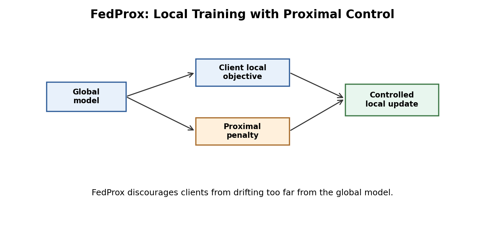

# Li et al. 2018: FedProx

Paper: "Federated Optimization in Heterogeneous Networks"  
Link: https://arxiv.org/abs/1812.06127

The diagram shows the central FedProx idea: local training is guided by the local objective but controlled by a proximal penalty that keeps the client close to the global model.

This paper studies a weakness of FedAvg: heterogeneity. In real federated systems, clients can have different data distributions, different amounts of data, different compute power, and different network quality. These differences can make local updates move in conflicting directions.

The authors proposed FedProx, which modifies local training by adding a proximal term. The idea is to discourage each client from moving too far away from the current global model. This helps reduce client drift when data is non-IID or when devices perform different amounts of local work.

The contribution is important because it shows that FedAvg is not always stable enough. Federated optimization needs mechanisms that respect the messy nature of real client populations.

What we learn is that local training is both the strength and weakness of FedAvg. It reduces communication, but if local data is very different, local models can overfit their clients and harm global convergence.

The limitation is that FedProx introduces an extra hyperparameter and does not remove all heterogeneity problems. It is a useful extension, not a full solution.
