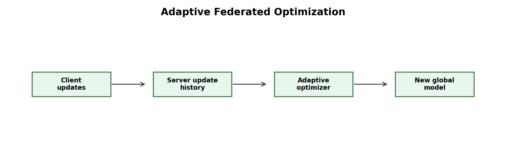

# Reddi et al. 2020: Adaptive Federated Optimization

Paper: "Adaptive Federated Optimization"  
Link: https://arxiv.org/abs/2003.00295

The diagram shows that the server is not passive: it can use update history and adaptive optimization before producing the next global model.

This paper studies the server optimizer in federated learning. In simple FedAvg, the server averages client updates. Reddi et al. asked whether adaptive optimization methods, such as Adam, Adagrad, or Yogi, can improve federated training.

The motivation is that federated learning often has heterogeneous data and unstable update patterns. In centralized deep learning, adaptive optimizers are useful because they adjust update sizes based on gradient history. The paper brings this idea to the federated server.

The main contribution is showing that the server-side update rule is an important design choice. Federated optimization is not only about what clients do locally; the server also shapes convergence.

What we learn is that FedAvg is a baseline, not a final optimizer. Adaptive federated methods can be stronger when client updates are noisy or heterogeneous.

The limitation is that adaptive methods add tuning complexity. They may improve convergence, but they also introduce extra hyperparameters and require careful evaluation across datasets and client distributions.
