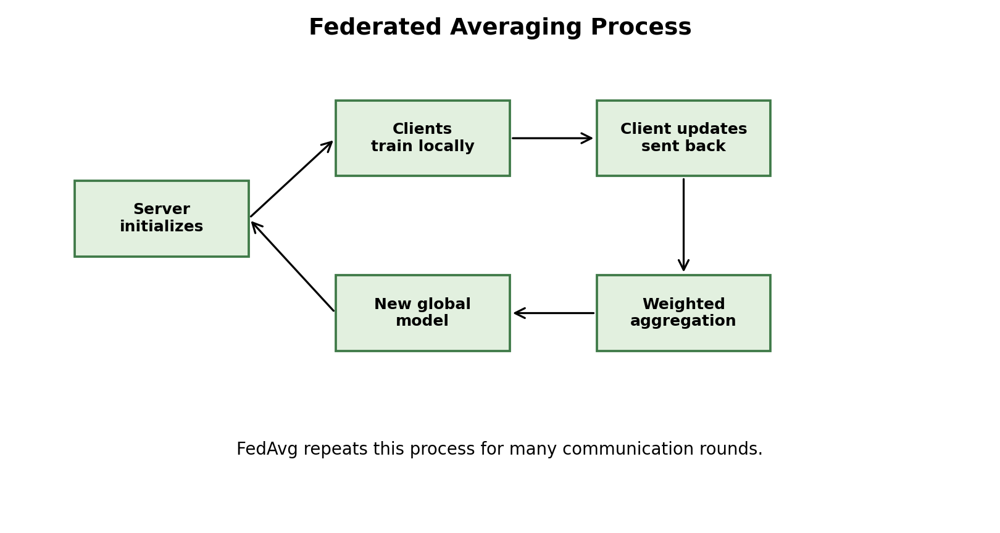

# Report: FedAvg and Federated Learning

Figure: overview of local training, model update upload, server aggregation, and global model update.

## Motivation

We reviewed FedAvg because it is the baseline algorithm behind much of federated learning. The important question is not only how it works, but also where it fails.

## Papers Reviewed

We reviewed McMahan et al. 2017 on FedAvg, Li et al. 2018 on FedProx, Kairouz et al. 2019 on open problems, and Reddi et al. 2020 on adaptive federated optimization.

## What The Papers Did

McMahan et al. proposed local client training plus server averaging. Li et al. introduced FedProx to handle heterogeneous clients. Kairouz et al. mapped the wider research area, including privacy and robustness. Reddi et al. studied adaptive server optimizers for federated training.

## Method

We extracted each paper's main contribution, limitation, and lesson. We also built a FedAvg process diagram and tables for algorithm steps and limitations.

## Review Artifacts

The repository contains reviewed-paper tables, a paper-comparison table, a FedAvg step table, a limitation table, process/design diagrams in `review_artifacts/`, and one short note for each reviewed paper in `paper_notes/`.

## Critical Limitations

FedAvg reduces communication, but it does not solve non-IID drift, privacy leakage from updates, unreliable client participation, or fairness. FedProx and adaptive server optimizers help, but they introduce extra hyperparameters and still do not make federated learning easy.

## Interpretation

FedAvg is simple and important, but real federated learning needs more. Non-IID data causes client drift, systems heterogeneity affects participation, and privacy is not automatic just because raw data stays local.

## Conclusion

FedAvg is best understood as a baseline. Practical FL research builds on it with proximal control, adaptive optimization, privacy protection, and robustness methods.
